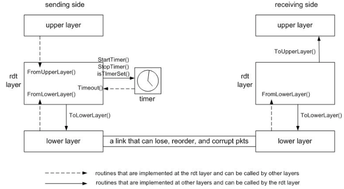
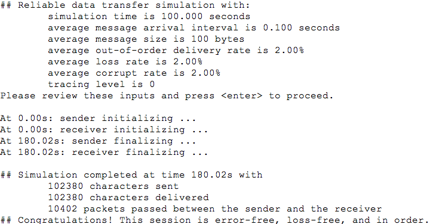

# Reliable Data Transport Protocol
* Implement sending and receiving side of Go-Back-N, one of reliable data transport protocols. The program is run in a simulated environment containing upper, lower layers of senders and receivers with link medium that can lose, reorder and corrupt packets. Routines are called when corresponding events occur.
* Achieved error-free, loss-free, and in-order data delivery based on user defined parameters of underlying link. 

## Diagram

## Parameters in simulator
* Simulation time in seconds.
* Average intervals between consecutive messages passed from the upper layer at the sender (in seconds). The actual interval varies between zero and twice the average.
* Average size of messages in bytes. The actual size varies between one and twice the average.
* Probability that a packet is not delivered with the normal latency - 100ms. A value of 0.1 means that one in ten packets are not delivered with the normal latency. When this occurs, the latency varies between zero and 200ms.
* Loss rate - packet loss probability: a value of 0.1 means that one in ten packets are lost on average.
* Corrupt rate - packet corruption probability: a value of 0.1 means that one in ten packets (excluding those lost) are corrupted on average. Any part of a packet can be corrupted.
* Tracing level - levels of trace printouts (higher level always prints out more information)
  * 0 turns off all traces
  * 1 turns on regular traces
  * 2 prints out the delivered message. 

## Test Case
The following are a few sample test cases. 
* rdt_sim 1000 0.1 100 0 0 0 0 - there is no packet loss, corruption, or reordering in the underlying link medium.
* rdt_sim 1000 0.1 100 0.02 0 0 0 - there is no packet loss or corruption, but there is reordering in the underlying link medium.
* rdt_sim 1000 0.1 100 0 0.02 0 0 - there is no packet corruption or reordering, but there is packet loss in the underlying link medium. 
* rdt_sim 1000 0.1 100 0 0 0.02 0 - there is no packet loss or reordering, but there is packet corruption in the underlying link medium. 
* rdt_sim 1000 0.1 100 0.02 0.02 0.02 0 - there could be packet loss, corruption, or reordering in the underlying link medium.

Sample output
